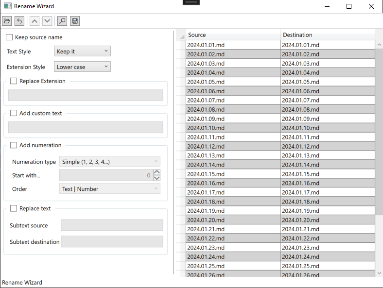

# Rename Wizard

This application allows you to rename files in bulk, providing a convenient way to perform various operations on file names such as substring replacement, adding numbering, and more. You can also manually edit the final name to make any necessary corrections.
Features:

    Bulk Renaming: Rename multiple files at once, saving time and effort.
    Operations: Apply various operations on file names, including substring replacement, adding numbering, and more.
    Manual Editing: Edit the final name manually for any specific adjustments or corrections.
    Preview Changes: Operations can be previewed before applying them, ensuring accuracy. Only confirmed changes are applied using the "Rename" button.

Usage:

    Select the files you want to rename.
    Apply desired operations on the file names.
    Preview the changes to ensure accuracy.
    Confirm the changes by clicking the "Rename" button.

